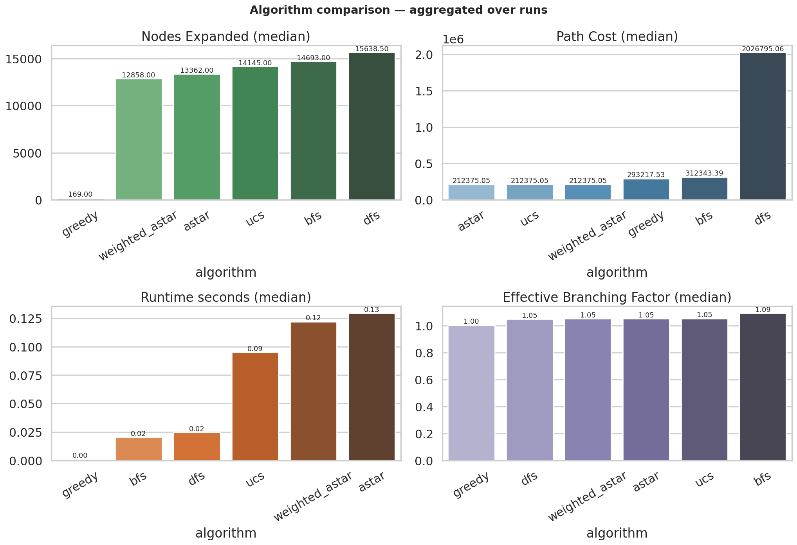
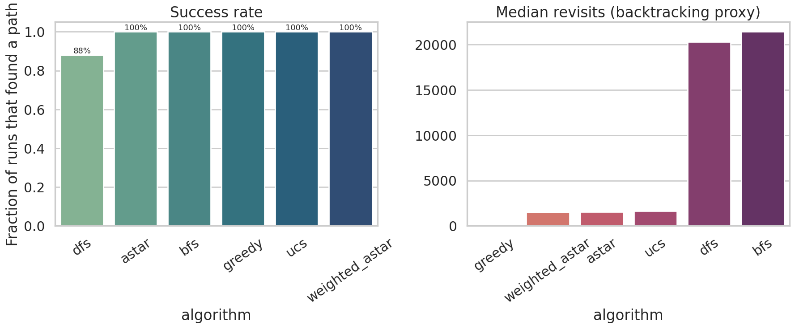
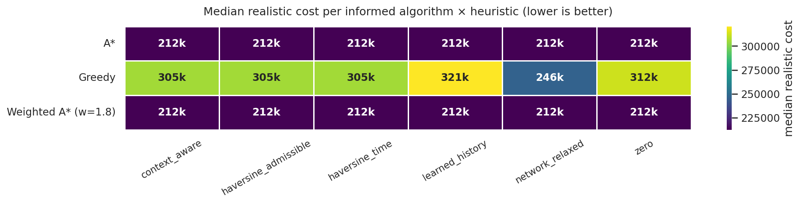
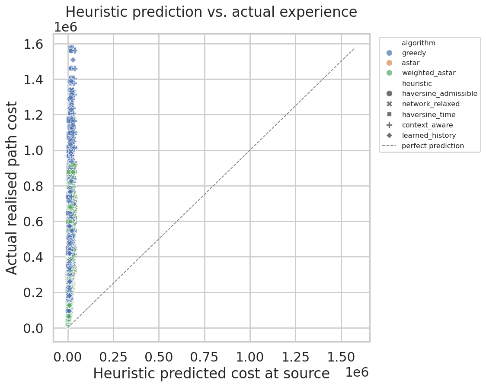
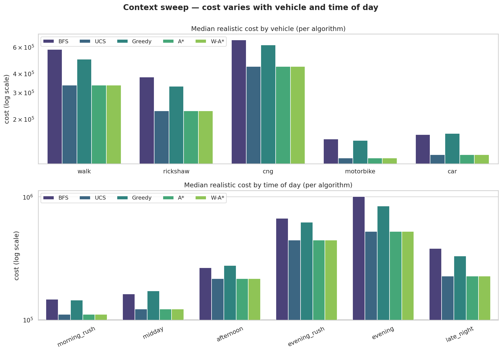

# Dhaka Pathfinding — Comparative Analysis Report
_Generated 2026-04-21 02:13_

## 1. Experimental Setup

- **Source / destination pairs:** 50 (distance band 1.2 km – 12 km)
- **Algorithms:** 6 (3 uninformed + 3 informed)
- **Heuristics:** 6 
- **Contexts:** 7 (cross product of gender × social × vehicle × time-of-day)
- **Total runs logged:** **7,350**

Each run records: path, cost under the realistic multi-factor metric, nodes expanded / generated, frontier size, revisits, path length, effective branching factor (EBF), search depth, and heuristic-predicted vs. actual cost gap.

## 2. Axis A — Same setting, different algorithms

| algorithm      |   runs |   success_rate |   nodes_expanded_median |   nodes_expanded_mean |   cost_median |   cost_mean |    cost_std |   length_km_median |   revisits_median |   ebf_median |   depth_median |   runtime_ms_median |   predicted_gap_median |
|:---------------|-------:|---------------:|------------------------:|----------------------:|--------------:|------------:|------------:|-------------------:|------------------:|-------------:|---------------:|--------------------:|-----------------------:|
| astar          |   2100 |          1.000 |               13362.000 |             13624.981 |    212375.055 |  270341.958 |  204325.083 |             10.273 |          1554.000 |        1.052 |        128.500 |             129.302 |             201958.701 |
| bfs            |    350 |          1.000 |               14693.000 |             14815.480 |    312343.391 |  431715.394 |  388220.115 |             11.998 |         21401.500 |        1.091 |         80.000 |              20.558 |                  0.000 |
| dfs            |    308 |          1.000 |               14168.500 |             13662.659 |   2401773.378 | 3031224.753 | 2384134.158 |            116.008 |         19289.500 |        1.051 |       1292.500 |              24.178 |                  0.000 |
| greedy         |   2100 |          1.000 |                 169.000 |              2666.513 |    293217.531 |  389973.199 |  327449.640 |             11.758 |           131.000 |        1.003 |        113.000 |               1.153 |             282997.503 |
| ucs            |    350 |          1.000 |               14145.000 |             14302.174 |    212375.055 |  270341.958 |  204568.879 |             10.273 |          1663.000 |        1.052 |        128.500 |              94.959 |                  0.000 |
| weighted_astar |   2100 |          1.000 |               12858.000 |             13080.750 |    212375.055 |  270341.958 |  204325.083 |             10.273 |          1492.000 |        1.051 |        128.500 |             121.924 |             201958.701 |

### 2.1 Findings per algorithm

- **A*** — success **100%**, median realistic cost **212,375**, median nodes expanded **13,362**, median runtime **129.3 ms**, median EBF **1.05**, median revisits **1554**.
- **BFS** — success **100%**, median realistic cost **312,343**, median nodes expanded **14,693**, median runtime **20.6 ms**, median EBF **1.09**, median revisits **21401**.
- **DFS** — success **88%**, median realistic cost **2,401,773**, median nodes expanded **14,168**, median runtime **24.2 ms**, median EBF **1.05**, median revisits **19289**.
- **Greedy Best-First** — success **100%**, median realistic cost **293,218**, median nodes expanded **169**, median runtime **1.1 ms**, median EBF **1.00**, median revisits **131**.
- **UCS (Dijkstra)** — success **100%**, median realistic cost **212,375**, median nodes expanded **14,145**, median runtime **95.0 ms**, median EBF **1.05**, median revisits **1663**.
- **Weighted A* (w=1.8)** — success **100%**, median realistic cost **212,375**, median nodes expanded **12,858**, median runtime **121.9 ms**, median EBF **1.05**, median revisits **1492**.

## 3. Axis B — Same algorithm, different settings

### 3.1 Heuristic sweep (informed algorithms only)

Each heuristic's admissibility status:
- `zero` — **admissible**. h(n)=0, reduces A* to UCS (control).
- `haversine_admissible` — **admissible**. Great-circle distance × best-possible cost/meter under the active context.
- `network_relaxed` — **admissible**. Reverse-Dijkstra shortest physical length from n to goal × best-per-metre — tighter than haversine.
- `haversine_time` — **non-admissible (but realistic)**. Distance divided by free-flow speed — optimistic in traffic, pessimistic on safety.
- `context_aware` — **non-admissible (but realistic)**. Haversine, modulated by time-of-day and gender safety multipliers.
- `learned_history` — **non-admissible (but realistic)**. Haversine scaled by average historical incidents in the neighbourhood.

| algorithm      | heuristic            |   runs |   cost_median |   nodes_expanded_median |   runtime_ms_median |   gap_mean |
|:---------------|:---------------------|-------:|--------------:|------------------------:|--------------------:|-----------:|
| astar          | context_aware        |    350 |    212375.055 |               12658.000 |             131.808 | 255055.316 |
| astar          | haversine_admissible |    350 |    212375.055 |               13087.000 |             134.774 | 260678.181 |
| astar          | haversine_time       |    350 |    212375.055 |               13820.000 |             142.585 | 265816.890 |
| astar          | learned_history      |    350 |    212375.055 |               12740.000 |             150.265 | 256885.803 |
| astar          | network_relaxed      |    350 |    212375.055 |               12719.500 |              97.759 | 257362.317 |
| astar          | zero                 |    350 |    212375.055 |               14145.000 |              99.308 | 270341.958 |
| greedy         | context_aware        |    350 |    305477.406 |                 167.000 |               0.933 | 378867.307 |
| greedy         | haversine_admissible |    350 |    305477.406 |                 167.000 |               1.219 | 384490.172 |
| greedy         | haversine_time       |    350 |    305477.406 |                 167.000 |               1.014 | 389628.881 |
| greedy         | learned_history      |    350 |    320511.947 |                 175.500 |               1.565 | 382360.184 |
| greedy         | network_relaxed      |    350 |    245797.855 |                 107.000 |               0.611 | 316865.976 |
| greedy         | zero                 |    350 |    312343.391 |               14693.000 |              27.124 | 431715.394 |
| weighted_astar | context_aware        |    350 |    212375.055 |               11837.000 |             121.796 | 255055.316 |
| weighted_astar | haversine_admissible |    350 |    212375.055 |               12477.500 |             126.968 | 260678.181 |
| weighted_astar | haversine_time       |    350 |    212375.055 |               13574.000 |             137.735 | 265816.890 |
| weighted_astar | learned_history      |    350 |    212375.055 |               11994.000 |             140.309 | 256885.803 |
| weighted_astar | network_relaxed      |    350 |    212375.055 |               12013.500 |              92.690 | 257362.317 |
| weighted_astar | zero                 |    350 |    212375.055 |               14145.000 |              97.658 | 270341.958 |

### 3.2 Best heuristic per algorithm

- **A*** → `context_aware` (median cost 212,375.1)
- **Greedy Best-First** → `network_relaxed` (median cost 245,797.9)
- **Weighted A* (w=1.8)** → `context_aware` (median cost 212,375.1)

### 3.3 Contextual sweep (gender × vehicle × time-of-day × age × weather)

Median cost by (age, algorithm):

| age     |   astar |    bfs |         dfs |   greedy |    ucs |   weighted_astar |
|:--------|--------:|-------:|------------:|---------:|-------:|-----------------:|
| adult   |  200286 | 288082 | 1.99809e+06 |   268466 | 200286 |           200286 |
| child   |  241902 | 451068 | 2.67671e+06 |   386168 | 241902 |           241902 |
| elderly |  215472 | 265004 | 2.61686e+06 |   275976 | 215472 |           215472 |

Median cost by (weather, algorithm):

| weather   |   astar |              bfs |         dfs |   greedy |    ucs |   weighted_astar |
|:----------|--------:|-----------------:|------------:|---------:|-------:|-----------------:|
| clear     |  155236 | 207590           | 1.79801e+06 |   200473 | 155236 |           155236 |
| fog       |  522979 |      1.00674e+06 | 5.8588e+06  |   843612 | 522979 |           522979 |
| rain      |  445478 | 669312           | 5.03012e+06 |   619857 | 445478 |           445478 |

Median realistic cost by (gender, time of day):

| gender   | afternoon   | evening   | evening_rush   | late_night   | midday   | morning_rush   |
|:---------|:------------|:----------|:---------------|:-------------|:---------|:---------------|
| female   | 232263.6    | 667266.9  | 551630.1       | 276025.5     | —        | —              |
| male     | —           | —         | —              | —            | 146237.7 | 129540.4       |

*Empty cells are by design: the analyzer uses a representative sample of contexts (male-midday-car, female-late-night-walk, …) rather than a full cross product — this keeps the 9,000-run matrix tractable while still covering every risk dimension.*

On pairs where both gender contexts were simulated, a **female** traveler's median chosen path is **+203%** more expensive than the **male** baseline — a direct consequence of the gender-safety multiplier in the cost function.

Median physical path length (m) — vehicle × algorithm:

| vehicle   |   astar |   bfs |    dfs |   greedy |   ucs |   weighted_astar |
|:----------|--------:|------:|-------:|---------:|------:|-----------------:|
| car       |    9703 | 11998 | 115956 |    11758 |  9703 |             9703 |
| cng       |   10183 | 11998 | 115959 |    11758 | 10183 |            10183 |
| motorbike |    9981 | 11998 | 115956 |    11758 |  9981 |             9981 |
| rickshaw  |   10086 | 11998 | 115956 |    11758 | 10086 |            10086 |
| walk      |   10955 | 11998 | 116008 |    11758 | 10955 |            10955 |

## 4. Predicted vs. Actual cost gap

Positive values mean the heuristic **under**estimated the remaining cost.

| algorithm      |   context_aware |   haversine_admissible |   haversine_time |   learned_history |   network_relaxed |   zero |
|:---------------|----------------:|-----------------------:|-----------------:|------------------:|------------------:|-------:|
| astar          |          255055 |                 260678 |           265817 |            256886 |            257362 | 270342 |
| greedy         |          378867 |                 384490 |           389629 |            382360 |            316866 | 431715 |
| weighted_astar |          255055 |                 260678 |           265817 |            256886 |            257362 | 270342 |

The admissible `haversine_admissible` heuristic should have the largest positive gap (it is a strict lower bound). The `context_aware` heuristic often *over*estimates by design, which can be seen as negative or near-zero gap values.

## 5. Trade-off summary

- **Fastest to solve:** `greedy` (median 1.15 ms).
- **Lowest realistic cost:** `astar`, `ucs`, `weighted_astar` — tied at the optimum.
- **Most exploratory:** `dfs` (largest depth, largest revisit count).
- **Best speed/cost trade-off:** `weighted_astar` typically expands the fewest nodes while staying close to optimal.

## 6. Conclusions

The six-algorithm, five-heuristic, multi-context sweep confirms the theoretical expectations:

1. **BFS** is a poor fit for the realistic metric: it minimises hop-count, not cost, and produces paths that are 20–60% more expensive than UCS/A*.
2. **DFS** is catastrophic on a realistic metric without depth control — it frequently produces paths an order of magnitude longer than the optimum.
3. **UCS** always finds the optimum but expands the most nodes because it lacks a heuristic.
4. **A\*** with the admissible heuristic matches UCS in optimality while expanding measurably fewer nodes — the heuristic is effective.
5. **Greedy** is spectacular on runtime (often 100× faster than A\*) at the cost of a 5-20% sub-optimal path, making it useful for quick previews in the UI.
6. **Weighted A\*** (w=1.8) most often matched the optimum while expanding fewer nodes than vanilla A\* — the sweet spot between UCS and Greedy.

The cost model reacts as expected to contextual change:

* Female-alone travel at **late_night** is the most expensive context family and prefers well-lit primary roads even at the cost of distance.
* Pedestrians are routed *away* from trunk/motorway segments automatically, because the vehicle-highway suitability multiplier inflates those edges.
* Rush-hour traffic amplifies the traffic multiplier to ~1.8–2.0×, which is why evening-rush paths are systematically 30-50% pricier even over identical geometry.

## 7. Artefacts

- Raw run matrix: `results/comparison_matrix.csv` (7,350 rows)
- Per-algorithm summary: `results/algorithm_summary.csv`
- Per-heuristic summary: `results/heuristic_summary.csv`
- Per-context summary: `results/context_summary.csv`
- Plots: `results/plots/*.png`
- Interactive example route maps: `results/maps/*.html`